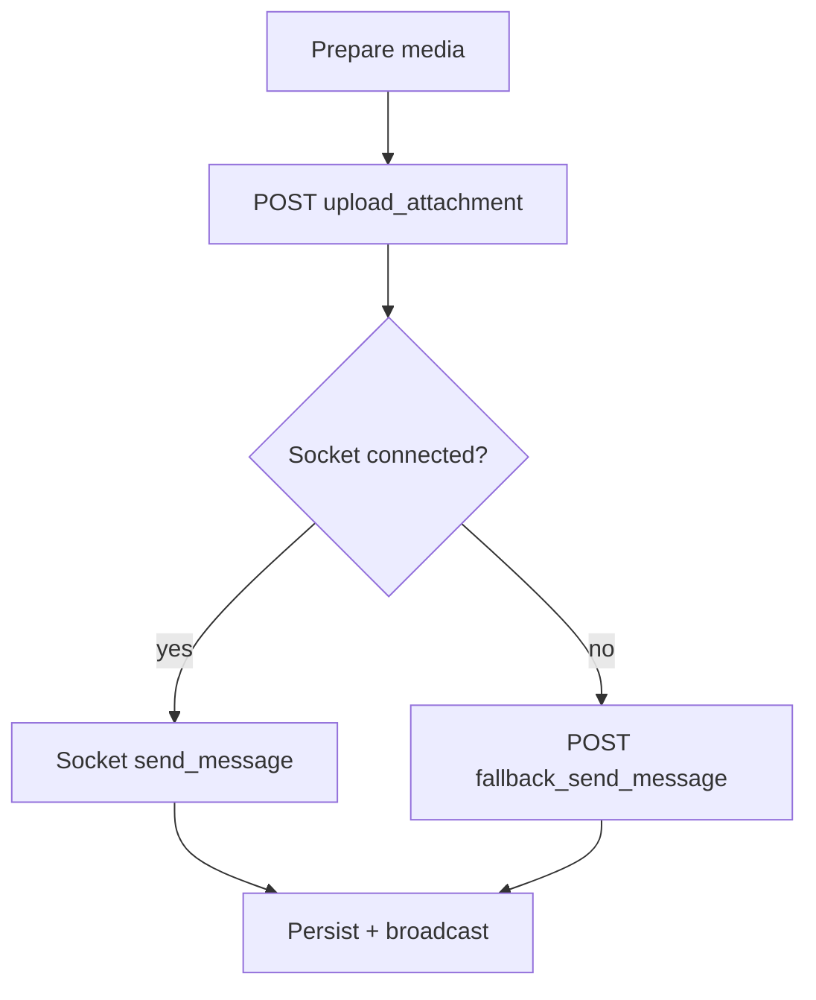

# Chat media — production client ↔ backend integration spec

This document is the **authoritative contract** for chat media (images + voice notes) between the **Hima Android app** and the backend. It supersedes earlier drafts and matches the **current client implementation** (including REST fallback when Socket.IO is unavailable).

**Client references**

- `ChatActivityInHouse.kt` — upload, socket send, REST fallback
- `ChatAdapter.kt` — rendering by `message_type`
- `ApiManager.kt` — `uploadChatAttachment`, `fallbackSendMessage`

---

## 1. High-level flow

1. User picks an image or records audio; the client compresses/prepares the file.
2. Client uploads via **`POST …/chats/upload_attachment`** (multipart). Backend returns a **public HTTPS URL** in `data.url`.
3. Client sends the chat message:
   - **Preferred:** Socket.IO `send_message` with `message_type` + `attachment_url` (and `message` often empty).
   - **If socket is disconnected after a successful upload:** **`POST …/fallback_send_message`** with the same logical fields (`message_type`, `attachment_url`, `message` empty).
4. History APIs (`chat_history`, `my_chat`, etc.) must return `message_type` and `attachment_url` for media rows so older sessions and cold starts render correctly.



---

## 2. App version / compatibility (media gate)

Backend may restrict media when **either** participant is below a **minimum app build** that supports media.

### Upload — compatibility error (example)

When media is not allowed for the pair (or sender build):

```json
{
  "success": false,
  "message": "Media messages are available only when both users are on a media-supported app version.",
  "data": {
    "required_min_version": 2001
  }
}
```

**Rules**

- `data.required_min_version` (int) **should** be present on this class of error so clients can parse it (the Android model includes `requiredMinVersion`).
- Human-readable copy remains in `message` (shown in a toast; optional “update app” UI can use `required_min_version` later).

### Success shape (unchanged)

```json
{
  "success": true,
  "message": "Upload successful",
  "data": {
    "url": "https://cdn.example.com/chat/…/file.jpg"
  }
}
```

`data.url` must be directly usable by the app (HTTPS, no short-lived upload-only URL unless the client is updated to refresh).

---

## 3. `POST /api/auth/chats/upload_attachment`

- **Content-Type:** `multipart/form-data`

| Field | Type | Required | Notes |
|--------|------|----------|--------|
| `user_id` | text/int | Yes | Authenticated sender |
| `to_user_id` | text/int | Yes | Receiver |
| `message_type` | string | Yes | `image` or `audio` |
| `file` | binary | Yes | JPEG / m4a (see below) |

### Client file behavior (Android)

| Type | Client behavior |
|------|------------------|
| **image** | JPEG, long edge ≤ 1280px, quality ~75 |
| **audio** | m4a/AAC, mono, 22050 Hz, ~64 kbps |

### Backend validation (recommended)

- **Image:** `image/jpeg` (optional png later); max size e.g. 10 MB  
- **Audio:** `audio/mp4`, `audio/m4a`, or `audio/aac`; max size e.g. 5 MB  
- Enforce chat permission between users (same as text).

---

## 4. Socket.IO — `send_message` (primary path)

After upload, when the socket is connected, the client sends a payload equivalent to:

```json
{
  "from_user_id": 12,
  "to_user_id": 45,
  "message": "",
  "message_type": "image",
  "attachment_url": "https://cdn.example.com/…/file.jpg"
}
```

- For media, **`message` may be an empty string**; **`attachment_url`** carries the payload.
- **`message_type`:** `text` | `image` | `audio` (extensible later).

Backend must persist and broadcast **`message_type`**, **`attachment_url`**, and **`message`** as stored.

---

## 5. `POST /api/auth/fallback_send_message` (REST fallback — **required for media**)

Used when Socket.IO is **not** connected (same as text fallback). The backend **must** accept optional media fields so the client does not drop uploads.

| Field | Type | Required | Notes |
|--------|------|----------|--------|
| `from_user_id` | int | Yes | Sender |
| `to_user_id` | int | Yes | Receiver |
| `message` | string | Yes | Text body; **empty string `""` for pure media** |
| `message_type` | string | No | Omit or `text` for plain chat; **`image` / `audio` for media** |
| `attachment_url` | string | No | **Required when `message_type` is `image` or `audio`** |

**Example — media via fallback (after successful upload)**

```http
POST /api/auth/fallback_send_message
Content-Type: application/x-www-form-urlencoded

from_user_id=12&to_user_id=45&message=&message_type=image&attachment_url=https%3A%2F%2Fcdn.example.com%2F…%2Ffile.jpg
```

**Response**

Same as existing text fallback: `success`, optional `message`, and `data.message` containing the persisted row (including `message_type`, `attachment_url`).

The Android client replaces the optimistic temp row by `id` from `data.message` when successful.

---

## 6. Chat history / list APIs

Any endpoint that returns chat messages for the app **must** include for each row:

- `message_type` (`text` | `image` | `audio`)
- `attachment_url` (null or URL for media)

For **legacy clients**, you may still return placeholder text in `message`; media-capable clients **must** prefer `message_type` + `attachment_url` for rendering.

---

## 7. Internal storage (recommended)

- Store files under a predictable prefix, e.g. `chat/images/…`, `chat/audio/…`.
- Return **stable public URLs** in DB and APIs.

---

## 8. Notify-when-online (chat list bell)

**No change** to this feature for media work. Existing APIs remain:

- `set_female_notification_preference`
- `get_female_notification_preference`

---

## 9. Backend checklist

- [ ] `upload_attachment` returns `data.url` on success; returns `data.required_min_version` on version-gated errors when applicable  
- [ ] `fallback_send_message` accepts optional `message_type` + `attachment_url` and persists media like socket  
- [ ] Socket handler stores/broadcasts `message_type` + `attachment_url`  
- [ ] History APIs return `message_type` + `attachment_url` for all media messages  

---

## 10. Android client behavior (summary)

| Step | Behavior |
|------|----------|
| Upload fails | Remove optimistic bubble; toast `message`; if `required_min_version` present, append `(min version: N)` to toast |
| Upload OK + socket up | Send via socket; delete local temp file |
| Upload OK + socket down | Call **`fallback_send_message`** with `message=""`, `message_type`, `attachment_url`; delete local temp file |
| Text + socket down | Unchanged: `fallback_send_message` with text only (optional fields omitted) |

---

*Document version: production sync — aligns with “Sync App with Backend Chat Media API” client changes.*
