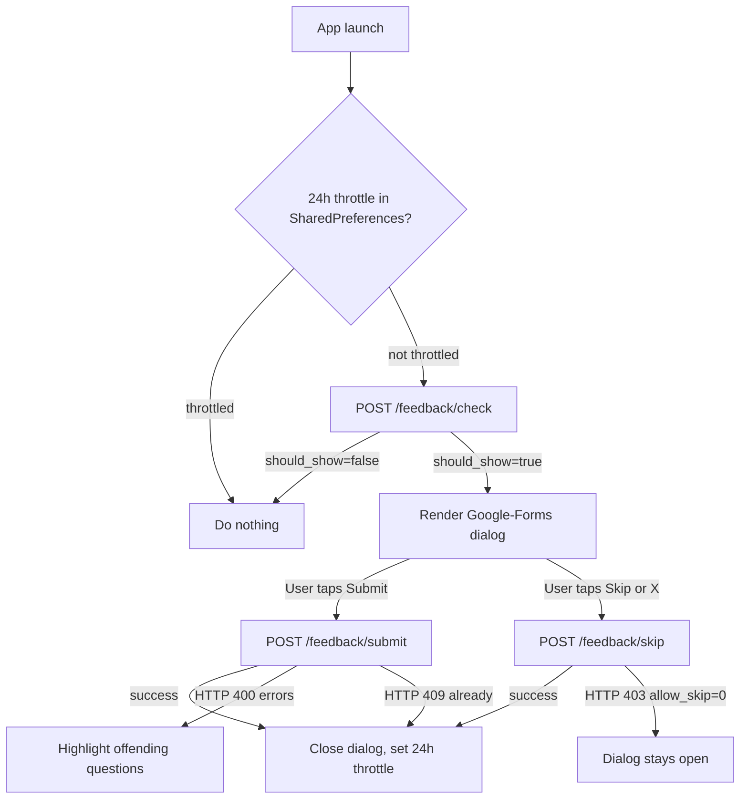

# Feedback Form API — Client Documentation

Client-side integration guide for the admin-configurable feedback form shown
once on app launch (Google-Forms-style, 1..N mixed-type questions).

The backend is live against the contract in [`feedback-form-api.md`](feedback-form-api.md).
This document is the single source of truth for the Android client: deployed
URLs, wire shapes, auth, and edge cases. Field names and JSON shapes here are
**load-bearing** — do not rename.

---

## Endpoints at a glance

| Purpose | Method | URL | Auth | Body |
|---|---|---|---|---|
| Check if a form should be shown | `POST` | `/api/auth/feedback/check` | JWT Bearer | `application/x-www-form-urlencoded` |
| Submit filled answers | `POST` | `/api/auth/feedback/submit` | JWT Bearer | `application/x-www-form-urlencoded` |
| Skip the form | `POST` | `/api/auth/feedback/skip` | JWT Bearer | `application/x-www-form-urlencoded` |

Base URL (production demo):

```
https://demolivedb.himaapp.in/api/auth
```

All three endpoints require the same `Authorization: Bearer <JWT>` header the
rest of `/api/auth/*` already uses. The body `user_id` **must equal** the
authenticated user id — any mismatch returns HTTP 403.

---

## Client flow



---

## 1. `POST /api/auth/feedback/check`

Returns the next pending form for the authenticated user, or
`should_show=false` when nothing is pending.

### Request

```
user_id=123
```

| Field | Type | Required | Notes |
|---|---|---|---|
| `user_id` | int | yes | Must equal `auth.user.id`. |

### Success — form available (HTTP 200)

```json
{
  "success": true,
  "should_show": true,
  "form": {
    "id": 7,
    "title": "Quick feedback",
    "description": "Help us improve. Takes under a minute.",
    "allow_skip": true,
    "questions": [
      {
        "id": 21,
        "sort_order": 1,
        "question_text": "How would you rate the call quality this week?",
        "help_text": "1 = poor, 5 = excellent",
        "question_type": "rating",
        "is_required": true,
        "min_rating": 1,
        "max_rating": 5,
        "max_length": null,
        "options": null
      },
      {
        "id": 22,
        "sort_order": 2,
        "question_text": "Which features did you use today?",
        "help_text": null,
        "question_type": "multi_choice",
        "is_required": false,
        "min_rating": null,
        "max_rating": null,
        "max_length": null,
        "options": ["Audio call", "Video call", "Chat", "Gifts"]
      },
      {
        "id": 23,
        "sort_order": 3,
        "question_text": "Anything else you want us to know?",
        "help_text": "Optional",
        "question_type": "text",
        "is_required": false,
        "min_rating": null,
        "max_rating": null,
        "max_length": 500,
        "options": null
      }
    ]
  },
  "message": "Form available"
}
```

Render questions in `sort_order` (server already orders them; do not re-sort).
For each question, the `max_length`, `min_rating`, `max_rating`, and `options`
fields that don't apply to the question type are returned as `null`. Hide the
question `help_text` row when it is `null` or empty.

### Success — no form (HTTP 200)

```json
{
  "success": true,
  "should_show": false,
  "form": null,
  "message": "No pending form"
}
```

Also returned when the user has already submitted or skipped every targeted
form — skipped forms never come back.

### Notes

- Every successful call that returns a form **increments** `shown_count` on
  the target row. If the dialog gets closed without Submit/Skip (e.g. crash),
  a later launch will see the same form again; use the 24h SharedPreferences
  throttle on the client to avoid re-showing immediately.
- `allow_skip=false` means the client must hide both the Skip button and the
  close (X) icon. The server also rejects `/skip` with HTTP 403 as a safety
  net.

### curl

```bash
curl -X POST https://demolivedb.himaapp.in/api/auth/feedback/check \
  -H "Authorization: Bearer <token>" \
  -d "user_id=123"
```

---

## 2. `POST /api/auth/feedback/submit`

Records the filled answers and marks the target as `submitted`.

### Request

```
user_id=123
form_id=7
answers=[{"question_id":21,"answer_rating":5},{"question_id":22,"answer_options":["Audio call","Chat"]},{"question_id":23,"answer_text":"Thanks!"}]
```

| Field | Type | Required | Notes |
|---|---|---|---|
| `user_id` | int | yes | Must equal `auth.user.id`. |
| `form_id` | int | yes | Must match a `pending` target row for this user. |
| `answers` | string (JSON-encoded array) | yes | See rules below. URL-encode it in the form body. |

#### `answers` entries

Each entry is `{ "question_id": <int>, ... }` plus **exactly one** value field
depending on the question type:

| `question_type` | Required field | Example |
|---|---|---|
| `rating`        | `answer_rating` (int) | `{"question_id":21,"answer_rating":5}` |
| `text`          | `answer_text` (string) | `{"question_id":23,"answer_text":"Thanks!"}` |
| `single_choice` | `answer_options` (array, length 1) | `{"question_id":30,"answer_options":["Yes"]}` |
| `multi_choice`  | `answer_options` (array) | `{"question_id":22,"answer_options":["Audio call","Chat"]}` |

Server-side validation rules:

- Every `is_required=true` question must have an entry with a non-null value.
- `rating`: `min_rating <= answer_rating <= max_rating` (defaults 1/5 when the
  question has them as `null`).
- `text`: when `max_length` is set, `length(answer_text) <= max_length`.
- `single_choice` / `multi_choice`: every string in `answer_options` must be
  one of the question's `options`. `single_choice` must send exactly one item.
- Extra answers for questions that don't belong to the form, or unknown
  `question_id`s, are flagged per-question and block the submit.

### Success (HTTP 200)

```json
{ "success": true, "message": "Feedback submitted" }
```

### Validation error (HTTP 400)

Map of offending `question_id` to a short reason. Highlight the offending
rows in red and keep the dialog open.

```json
{
  "success": false,
  "message": "Invalid answers",
  "errors": {
    "21": "rating must be between 1 and 5",
    "22": "answer_options contains invalid values"
  }
}
```

Top-level field problems (missing `user_id`/`form_id`/`answers`, bad JSON)
also return 400 but with Laravel validator output under `errors`, not a
per-question map.

### State conflict (HTTP 409)

Returned when the target row is already `submitted` or `skipped`. Treat this
as terminal — close the dialog, set the 24h throttle.

```json
{ "success": false, "message": "Form already submitted" }
```

### Not found (HTTP 404)

No `feedback_form_targets` row exists for `(form_id, user_id)`, or the form
has no questions.

```json
{ "success": false, "message": "Form target not found for this user" }
```

### curl

```bash
curl -X POST https://demolivedb.himaapp.in/api/auth/feedback/submit \
  -H "Authorization: Bearer <token>" \
  --data-urlencode "user_id=123" \
  --data-urlencode "form_id=7" \
  --data-urlencode 'answers=[{"question_id":21,"answer_rating":5},{"question_id":22,"answer_options":["Audio call","Chat"]},{"question_id":23,"answer_text":"Thanks!"}]'
```

---

## 3. `POST /api/auth/feedback/skip`

Records a skip and marks the target as `skipped`.

### Request

```
user_id=123
form_id=7
```

| Field | Type | Required | Notes |
|---|---|---|---|
| `user_id` | int | yes | Must equal `auth.user.id`. |
| `form_id` | int | yes | Must match a `pending` target row for this user. |

### Success (HTTP 200)

```json
{ "success": true, "message": "Feedback skipped" }
```

Idempotent — calling `/skip` on an already-skipped target returns success
without writing duplicates.

### Skip forbidden (HTTP 403)

Returned when the form has `allow_skip=false`. The client should never
reach this path because it hides Skip and X when `allow_skip` is false, but
the backend enforces it as a safety net.

```json
{ "success": false, "message": "Skip not allowed for this form" }
```

### State conflict (HTTP 409)

Returned when the target row is already `submitted`.

```json
{ "success": false, "message": "Form already submitted" }
```

### curl

```bash
curl -X POST https://demolivedb.himaapp.in/api/auth/feedback/skip \
  -H "Authorization: Bearer <token>" \
  -d "user_id=123&form_id=7"
```

---

## Error contract (all three endpoints)

| HTTP | Body | Meaning |
|---|---|---|
| 400 | `{success:false, message:"Invalid answers", errors:{…}}` | Per-question validation failure on `/submit`. |
| 400 | `{success:false, message:"Invalid request", errors:{…}}` | Missing/malformed top-level field on any endpoint. |
| 401 | `{success:false, message:"Unauthorized."}` | Missing/invalid JWT. |
| 403 | `{success:false, message:"user_id must match authenticated user."}` | Body `user_id` != token user. |
| 403 | `{success:false, message:"Skip not allowed for this form"}` | `/skip` on a form with `allow_skip=false`. |
| 404 | `{success:false, message:"Form target not found for this user"}` | No pending target row for `(form_id, user_id)`. |
| 404 | `{success:false, message:"Form not found"}` | The form id doesn't exist. |
| 404 | `{success:false, message:"Form has no questions"}` | Misconfigured form reaching `/submit`. |
| 409 | `{success:false, message:"Form already submitted"}` | Terminal state — close dialog. |
| 409 | `{success:false, message:"Form already skipped"}` | Terminal state — close dialog. |
| 500 | `{success:false, message:"Something went wrong"}` | Unexpected backend error. Retry later. |

---

## Edge cases the client should handle

These are all already covered by the spec; listing them for quick reference:

- **User already submitted or skipped** — `/check` returns `should_show=false`.
  Do nothing.
- **Multiple pending forms for one user** — the server always returns the
  **oldest** (smallest target id) first. Finishing one reveals the next on
  the next launch.
- **User not in any target list** — `/check` returns `should_show=false`.
- **Empty form (no questions)** — should not happen with valid admin config,
  but the client fallback is to call `/skip` immediately so the target row
  settles and stops getting served.
- **Re-shown form** — if the same target gets served twice (crash between
  open and submit), the client's 24h SharedPreferences throttle prevents a
  second prompt in the same day. `shown_count > 1` server-side is expected,
  not an error.
- **`allow_skip=false`** — hide the Skip button **and** the X/close icon on
  the dialog. Tapping the scrim should also be ignored.
- **Validation error (HTTP 400) on submit** — keep the dialog open, show the
  per-question error strings from `errors`, let the user fix and retry.

---

## Field reference — question payload

Returned in every question object from `/check`.

| Field | Type | Notes |
|---|---|---|
| `id` | int | Use as the key when building `answers`. |
| `sort_order` | int | Already pre-sorted by the server — render in array order. |
| `question_text` | string | The question shown in bold. |
| `help_text` | string \| null | Small grey subtitle. Hide when null or empty. |
| `question_type` | string | One of `rating`, `text`, `single_choice`, `multi_choice`. |
| `is_required` | bool | When true, show red `*` and block submit if unanswered. |
| `min_rating` | int \| null | Only for `rating`. Default 1 when null. |
| `max_rating` | int \| null | Only for `rating`. Default 5 when null. |
| `max_length` | int \| null | Only for `text`. Enforce counter on the client. |
| `options` | string[] \| null | Only for `single_choice` / `multi_choice`. |

## Field reference — answer payload

Sent in the `answers` JSON array on `/submit`.

| Field | Type | When to include |
|---|---|---|
| `question_id` | int | Always. |
| `answer_rating` | int | Only for `rating` questions. |
| `answer_text` | string | Only for `text` questions. |
| `answer_options` | string[] | Only for `single_choice` (length 1) / `multi_choice`. |

Do not include the other two answer fields — server-side validation allows
them to be absent, but mixing them may read as a malformed entry.

---

## Out of scope

- Event-triggered forms (post-call, post-chat).
- Per-question conditional logic.
- Editing a previously submitted response.
- Admin endpoints (`/admin/feedback/*`) — these are Postman/curl only and
  live behind the existing session-based admin panel. Not relevant to the
  Android client.
