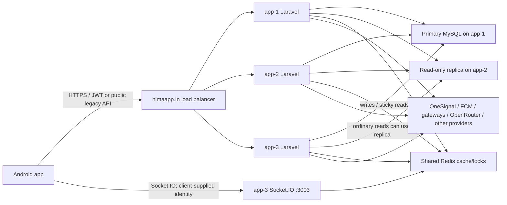

# HIMA Diagnostic System Map

Snapshot: 2026-07-14 IST  
Targeted call ring-heartbeat review: 2026-07-15 IST  
Targeted FCM ownership/delivery/worker strong review: 2026-07-15 IST  
Targeted creator availability/DND/queue/auto-disable strong review: 2026-07-15 IST  
Targeted creator withdrawal/bank/KYC/payout/refund strong review: 2026-07-15 IST  
Targeted admin/MCP security-plane strong review: 2026-07-15 IST  
Targeted gifts/rewards/admin-wallet/ledger strong review: 2026-07-15 IST  
Targeted media upload/storage/cache/three-node strong review: 2026-07-15 IST  
Final strong-model batch review: 2026-07-15 15:40 IST  
Status: audited, reconciled, read-only  
Detailed evidence: [HIMA Audit Master](HIMA_AUDIT_MASTER.md)

This is the fast entry point for future HIMA bugs and changes. It is not a substitute for checking the small set of implicated live files/current flags at incident time; it prevents re-auditing the entire system for every report.

## System model

Operational truths:

- Production code is hand-patched, not pulled from Git. app-1/app-2 active source is identical at this snapshot; app-3 has specific drift listed below.
- Android and Laravel often trust body-supplied user IDs even when a JWT exists. Identity bugs must compare JWT subject, requested IDs, stored participants, and device token ownership.
- Socket.IO traffic normally reaches app-3, but legacy listeners remain on all nodes. The Node protocol has no authenticated socket identity.
- MySQL primary and replica schemas match, but app-3 can return lagging replica data on a later request. All Laravel nodes share one Redis server despite different host strings.
- Media is node-local with asymmetric synchronization: app-1/app-2 mirror both ways, app-1 forwards to app-3, app-3 never mirrors back, and all directions use `delete=false`. A successful upload or delete does not guarantee all nodes converge.
- `transactions` is a mixed event/history ledger, not double-entry accounting. Current balances plus provider/call/gift/withdrawal records must be reconciled together.

## The first seven checks for any bug

1. Record exact user IDs, role/gender/language, app version, operation time in IST, request route, and whether the issue repeats or is intermittent. Do not rely on mobile/name alone because duplicates exist.
2. Identify the serving Laravel node and whether the action used REST, Socket.IO, scheduler, webhook, admin UI, or MCP. Node identity is a first-class diagnostic variable.
3. Confirm the live route and target method on that node. Route/controller drift and missing methods are common; Git route presence is not proof.
4. Compare JWT subject with every body/path user ID and the stored row participants/owner. Cross-account trust is the most repeated defect family.
5. Reconstruct state from the authoritative store, not the UI label: primary DB for committed truth, provider status for external money, Redis only for transient state, and current user balances plus ledgers for money.
6. Order events using IST for Laravel-written datetimes and UTC for MySQL functions/log sources as appropriate. Normalize before deciding which actor ran first.
7. Check the async/outward boundary: second scheduler node, public cron, webhook retry, Socket.IO fallback, provider timeout, push result, or client retry after an unknown commit.

## Global root-cause clusters

| Cluster | Repeated executable pattern | Bugs it explains |
|---|---|---|
| Identity trust | JWT exists but body/path IDs are trusted; public routes accept arbitrary user IDs | Wrong account/profile, forged ratings/favourites, cross-account calls/chat/tickets, notification/token hijack, money mutation |
| Non-atomic state | Read/check/provider call/write/log/push occur in separate steps without row claim/idempotency | Duplicate credits/debits/messages/pushes, partial success, unknown outcome, double payout/refund |
| Contract drift | Android, Laravel, Socket.IO, admin views, and provider response handling use different enums/payloads/status meanings | UI says success while server failed, wrong friend tab, stuck messages, broken admin buttons, false checkout error |
| Node drift | app-3 source/read connection/view differs; media and JSON config can be node-local | Intermittent admin behavior, stale reads, missing media, voice verification inconsistency, alternating UI |
| Multiple ledgers | Operational balances, transactions, provider rows, calls, gifts, subscriptions, and withdrawals are not one invariant | Balance/ledger disagreement, invoice mismatch, paid/cancelled state ambiguity |
| Mutable analytics | Reports reconstruct history from current `last_seen`, `verified_datetime`, current user fields, or first-send-to-now attribution | Dashboard/export numbers change retroactively or disagree with finance/provider truth |
| Public/weakly guarded operations | Public cron/analytics/conversion/payment primitives; support hidden only by menu; MCP bypasses web 2FA | Abuse surface, direct-route access, unplanned spend/outward actions, forged attribution |
| Node-local files | Upload saved on handling node; asymmetric sync and `delete=false` | Random 404, AI file missing, deleted file reappears, different node sees different asset set |

## Feature and authority map

| Feature | Current classification | Authoritative implementation/state | First likely bug causes |
|---|---|---|---|
| Login/register/OTP | Active, critically weak ownership proof | Android `NewLoginActivity`/`VerifyOTPActivity` local OTP flow + public Laravel login/register + `users` | Local OTP bypass; backend never proves OTP; duplicate mobile; unordered matching; 90-day JWT not revoked; legacy `LoginActivity` still present but not the launcher |
| Profile/config | Active | Android caches + `AuthController` + `users`/language config | Body-ID IDOR; stale cache; partial response; name-validation race; app-3 replica lag |
| AI onboarding | Android flag-off; backend residually active | Three JWT APIs + OpenRouter + onboarding tables/chat inserts | Old/direct client; provider timeout; invisible reply; preview text differs; partial three-recipient delivery |
| Voice/creator approval | Inline AI active on app-1/app-2; manual fallback and app-3 pending | `update_voice`, `VoiceVerificationService`, verification admin, voice tables/files; mode enforce | app-3 missing service causes caught failures/pending uploads; node-local voice; synchronous provider latency; unbounded app-3 list; stale flag/UI description |
| Direct/random calls | Active | call controllers, Redis ringing/liveness, `user_calls`, Android call activities | IDOR participants; receiver not locked; double rings; client-controlled time; state race; current-source `call_ring_heartbeat` has no receiver on any live node |
| Agora/signaling | Active | public token/FCM relay plus Android Agora | Arbitrary publisher token; public state mutation; channel/participant mismatch; push delivery failure |
| Call settlement | Active, financially fragile | `user_calls`, `users.coins/balance/income`, `transactions` | Non-atomic settlement; forged duration/IDs; retry after timeout; duplicate actors; synthetic switch path |
| Call bonuses | Master off | duration-bonus service/tables/app settings | Dormant unsafe cap race; client popup/final state may diverge if enabled |
| Chat | Active | app-3 Socket.IO, REST fallback, `chat_messages`/chat tables | Unauthenticated socket identity; REST/socket policy mismatch; ambiguous ack; retry duplicate; filter/type bypass |
| Friends | Active | friend APIs/tables + Socket.IO notification callback | Reversed status mapping; partial-save 500; duplicate pairs; missing internal push method; stale badge contracts |
| Blocking/favourites | Active | pair tables plus global `users.blocked` | Body-ID IDOR; pair/global state conflation; duplicate pairs; bulk unblock clears moderation block |
| Recharges | PhonePe and Cashfree active | provider order tables, `transactions`, `users.coins` | Compatibility success before credit; webhook/checker race; unknown provider outcome; public legacy mint paths |
| Google Play/Razorpay/EKQR | Executable but normally unassigned/dormant | Legacy Android/server branches | Public completion/mint exposure; incompatible/missing completion receiver; unsafe purchase consumption |
| Autopay | Active for Hindi/Punjabi only | Cashfree subscriptions, events, daily claims, Android checkout | Orphan/overwritten provider ID; external create before local identity; false client error; cancel false ignored; event claiming gaps; unlocked renewal balance overwrite and missing `total_coins` update |
| Gifts | Active | sender/receiver balances plus transaction rows | Body-ID sender; no transaction/lock/idempotency/call proof; four-write partial transfer |
| Creator withdrawals | Bank active; UPI off | `withdrawals`, balances, PaySprint/Cashfree, cron/webhook/admin | Provider accepted before DB intent; unsigned webhook acceptance; concurrent refund; phase starvation; retry classifier is log-only and still refunds; manual status lies |
| Admin money changes | Active/manual | withdrawal admin, XLS import, urgent credit, visible user wallet fields, addCoins/addBalance/addBonus helpers | Role/menu boundary; invalid transitions; double refund/pay; spreadsheet partial apply; direct wallet overwrite has no ledger; unlocked save-then-ledger helpers can partially commit/lose updates/duplicate retries; admin `add_coins` is misclassified as payment by offers, segments, notifications, analytics, and invoices; no provider proof |
| Creator availability/DND | Active | `users`, DND/status logs, creator queue, missed-call counter | Body-ID IDOR; local DND cleared before server; DND drops every push type; duplicate open sessions; non-unique queue; duplicate sends or dropped failed sends; public cron races; badge count and auto-disable use different missed-call signals |
| Warnings/moderation | Current engine active; two legacy engines reachable | moderation/warning tables + user flags + chat deletion | Non-transactional escalation; every level-up deletes chat; incompatible levels; expiry/manual block conflict |
| Tickets/support AI | Active | ticket APIs/admin/MCP + OpenRouter + node-local media + OneSignal | Cross-account/public mobile disclosure; duplicate ticket after AI timeout; account context provider exposure; delayed reply stranded; reply/screenshot files can diverge by handling node |
| Ratings/reports/reviews | Mixed | call ratings, user reports, review rewards | Ratings forgeable/no call proof; Report User live API missing; review reward duplicate/no reversal; Google prompt off |
| Agency portal | Active | agency session/admin Basic auth + assignments/settlements | Weak login/session; shared admin secret; reassignment bypass; stale settlement description; duplicate payment bookkeeping |
| Admin web auth | Active with TOTP | admin session/2FA/roles | TOTP rebind via password; support broad direct routes; ineffective verified middleware; menu is not authorization |
| FCM token ownership / push retry | Active | `send_fcm_token`, `invalidate_fcm_token`, login/Main Retrofit registration, cold-start direct + WorkManager resync, `MyFirebaseMessagingService`, `FcmTokenRegisterWorker`, `FcmTokenInvalidationWorker` | caller-supplied `user_id`; logout does not cancel old registration work, allowing post-logout/cross-login token rebinding; bearer/token stored in worker input; internal OneSignal failure can be reported as success; no durable delivery queue |
| MCP | Active, high impact | bearer tokens/scopes/audit + controller tool methods | Web 2FA bypass; non-expiring/unlinked tokens; role mapping drift; logout does not revoke; payout-count budget telemetry always reports zero because it reads a nonexistent token field |
| Creator/screen/smart notifications | Active by family | OneSignal, schedule/queue/log tables, shared Redis | Non-atomic claim; no durable attempt ledger; segment dedupe bug; node-local media; public conversion forgery |
| Analytics/cached reports | Active/manual/public depending surface | large-table aggregates, cache, views/exports | Misleading definitions; public PII/finance; unbounded ranges; `whereDate`; dogpile; mutable current-state reconstruction |
| Posters/content | Current web generator used | OpenRouter/Gemini/GD + node-local JSON/files | Provider-controlled image URL; spend/role boundary; missing feature assets; false `hima_readonly`; node-local save |
| Icebreakers | Content populated; all flags off | admin import + question/seen tables + call activities | Import lacks limits/dedup/transaction; unsupported languages; feature flag/cache mismatch if enabled |
| Exports/invoices | Mixed active/broken/manual | users/reports/transactions/admin controllers | full-population PII export; heavy report anti-join; missing methods; PDF/CSV amount and numbering disagreement |
| NudeNet lab | Demo-only accuracy/policy experiment; absent production | `demohima.himaapp.in` superadmin lab + local uncommitted backend files | HIMA demo policy v0.6 maps narrow detector-evidence combinations to Warning/No warning/Review required and shows the strongest relevant confidence for review cases; no real warnings/account actions; do not diagnose production through it |
| Call moderation shadow | Demo-only consent-gated capture review; absent production | `demohima.himaapp.in/call-moderation` + five call-moderation tables + dedicated Redis worker | 1/5/10-minute local-participant frames grouped per call; one shadow action per participant/call; no live warnings; permanent private evidence with a 2 GiB capacity guard and no delete/purge path |

## Authoritative stores and semantic warnings

| Store | What it is authoritative for | What it does **not** prove |
|---|---|---|
| `users` | Current profile, role/gender/language, coins, balance, creator status, availability | Mobile/name uniqueness; immutable history; correct ownership of request; complete earnings ledger |
| `user_calls` | Persisted call rows and recorded settlement timestamps/amounts | Authentic participants/duration; one call per ring; finality when writes were partial |
| `transactions` | Mixed event/history records created by many flows | Double-entry accounting; all balance mutations; consistent units/signs; actual paid amount when discounts exist |
| provider payment tables | Local view of provider orders and status | Coin credit completed; webhook authenticity in every branch; no orphan provider object |
| `user_subscriptions` + events/claims | Current mapped mandate and processed events/claims | Every provider mandate for a user; credit for every success; successful provider cancellation |
| `withdrawals` | Current HIMA payout request/status convention | Provider payout truth; refund occurred; immutable bank details; status 1 means bank paid |
| chat/friend/block tables | Persisted relationship/message state | Socket sender authenticity; pair uniqueness; consistent Android status label |
| notification ledgers | HIMA send/conversion/tap records | Provider delivery; unique recipient; causal conversion; unforgeable user action |
| `last_seen` / `verified_datetime` | Current last activity/current verification timestamp | Historical DAU/approval event on an arbitrary past date |
| Redis | Cache, transient locks/presence/liveness | Durable claim/audit; global socket presence helper; committed business state |
| node-local storage | File exists on that node | File exists on every node or remains deleted everywhere |

## Production node drift map

| Area | app-1/app-2 | app-3 consequence |
|---|---|---|
| Default DB reads | Primary | Can read replica; later request may be stale |
| Voice verification service | Present | Missing; inline scoring skipped/caught |
| Verification admin | Capped + toggle/Gemini accuracy | Unbounded old page; missing action failures |
| Voice batch scoring | Configurable prompt gate + voice model | Prompt gate always required + general model accessor |
| Creator Dashboard header/session | Workspace switch/reset present | Switch/reset absent; navigation state differs |
| User-call end rendering | Hides end when start absent | Always displays end time |
| Withdrawal `$fillable` | Fee fields absent | Fee fields present; latent mass-assignment difference |
| Socket.IO | Listener present but nginx forwards to app-3 | Normal traffic terminates here; port publicly bound |
| Media | app-1/app-2 mirror bidirectionally; app-1 forwards to app-3 | Can accumulate files that never flow back; no deletion convergence |

Routes, middleware, migrations, primary/replica schema, Redis cache, and most active source are otherwise uniform at the snapshot.

## Symptom-to-first-check matrix

| Reported symptom | Highest-probability audited causes | First evidence to inspect |
|---|---|---|
| OTP accepted incorrectly / account opened without OTP | Local OTP verification/bypass; backend login needs only mobile | App version/flow, login route, exact mobile duplicate count, JWT subject |
| Logged into wrong account / profile changes another user | Duplicate mobile + unordered lookup; body-ID IDOR; poisoned cache | All rows for exact mobile under approved query, JWT subject vs response/user ID, Android cached user |
| Creator is online but receives no calls | Server DND remains; availability changed by another account; app-3 stale read; auto-disable/missed-call state | `users` availability/DND on primary, latest status logs, `users.missed_calls`, serving node, queue/notification logs |
| Call rings twice / creator gets two callers | Receiver row not locked; concurrent matcher actors; stale busy/ringing state | overlapping `user_calls`, Redis ring keys, request times/nodes, creator availability at decision time |
| Call connected but no audio/video | Public token/channel/UID mismatch; signaling push loss; Agora state/client lifecycle | exact channel/UID/token request, both app logs, FCM delivery, Agora join callbacks |
| Coins deducted twice / creator paid twice | settlement retry/parallel actors; client-controlled terminal calls; non-atomic balance/ledger | exact call ID, all transaction rows, before/after balances, settlement endpoints/logs and timestamps |
| Call ended but remains busy/ghost | terminal write failed; orphan cron timing; Redis heartbeat mismatch; wrong participant IDs | call status/times, Redis liveness, orphan logs, serving node, both client terminal attempts |
| Message stuck, duplicated, or reappears | ambiguous socket ack; retry after unknown commit; delete emit treated as success; REST fallback policy | temp/client payload, persisted message IDs/times, Socket.IO event logs, fallback request, delete error |
| Message delivered but no push / duplicate push | process-local presence; missing friend-push method; fallback always pushes; provider/log partial success | serving socket node, receiver room/presence, OneSignal result/log, internal callback response |
| Friend appears in wrong tab / rejection failed | Android status-2/3 reversal; save then nonexistent helper 500; duplicate pair rows | exact friend row statuses/counts, HTTP response after mutation, current Android mapper |
| Favourite/block changed unexpectedly | body-ID IDOR; duplicate pair; pair/global block conflation; bulk unblock | JWT/body IDs, all pair rows, global `users.blocked`/moderation state |
| Payment says success but coins missing | PhonePe checker stopped early/missed webhook; compatibility response; Cashfree pending; autopay orphan | provider order status, local order row, coin ledger, current balance; never UI alone |
| Coins exist without valid payment | public/legacy completion route; forged body ID; webhook/provider fail-open; duplicate credit | provider proof, transaction payment key, route/access log, credit actor |
| Autopay checkout says failed although mandate exists | Android cannot consume `already_active`; local mapping lost after provider create | all provider mandate IDs, current subscription row, event history, initiate response shape |
| Autopay cancelled but charged later | provider cancel false ignored; old ID overwritten; terminal rows stop polling | every historical provider ID/event, cancel response/log, current row only as a lead |
| Withdrawal pending forever | missing transfer ID; newest-25/phase starvation; provider error; public cron overlap; bank path may also be retrying `beneficiary_not_found` with case-variant `beneId`s before failing | transfer ID/status, provider status, cron phase/log, row age/order, beneficiary rejection payload |
| Withdrawal paid and refunded / refunded twice | urgent credit + late provider success; concurrent cron/admin/webhook; spreadsheet status transition | provider transfer truth, balance transactions, manual markers, all status timestamps |
| Ticket missing/wrong user/duplicate | body-ID IDOR; duplicate mobile public lookup; AI timeout after insert; partial media node | JWT/body/mobile mapping, ticket row before retry, provider timing, serving/storage node |
| Warning unexpectedly deleted chats / block returned | warning level-up always deletes history; partial escalation; legacy expiry/manual-block conflict | moderation + legacy warning rows, user flags, chat deletion time, actor/admin route |
| Admin page/button gives 500 | route points to missing method; app-3 older controller; support direct-route mismatch | live route/action on serving node, route inventory, retained error/access log |
| Admin page randomly changes/looks different | app-3 view/controller/header drift; session workspace; replica read | serving node, live file hash, session `cad_workspace`, primary vs replica result |
| Admin report/export times out | unbounded range; repeated correlated anti-join; `whereDate`; full materialization | route/range, 499 pattern, EXPLAIN before query, row estimates and indexes |
| Dashboard/export numbers disagree | mutable `last_seen`/verification; nominal vs discount amount; different cohorts/windows | executable metric definition, source columns/time window, provider/primary aggregate |
| Uploaded image/voice/ticket file intermittently 404 | node-local write, asymmetric lsyncd with `delete=false`, app-3 not in reverse mirror, app-3-only accumulation, incorrect storage URL | storage existence on all nodes, DB path, handling node, sync direction, deletion behavior |
| Unexpected background media request or stale cached media | retired trial-offer sheet still has active `MainActivity.onResume()` prefetch; ticket cache copies lack explicit deletion; Glide has no central invalidation | Activity/resume frequency, `trial_offer_config` calls, active language asset, `cacheDir`, Glide URL/signature |
| Rating prompt or feedback stops reappearing after one offline check | client writes local 24h throttle before the backend check completes; `appsettings.rating_enabled` or missing routes can also suppress by design | `rating_prompt_prefs` / `feedback_form_prefs` `last_check_time`, `appsettings.rating_enabled`, prompt logs, feedback routes |
| Invoice/PDF and CSV disagree | PDF nominal amount vs CSV discount price; different invoice populations | transaction amount/discount/type/date, single vs bulk numbering query |

## Performance gate

Before any production aggregate or proposed DB/app change:

1. Identify table size and exact predicates/joins.
2. Inspect relevant indexes; do not assume migration/index names are deployed.
3. Run `EXPLAIN` only, using the exact production query shape and bounded representative range.
4. Prefer range predicates over `DATE(column)`/`whereDate` on large tables.
5. Avoid materializing large ID lists, full Eloquent collections, per-row correlated subqueries, or unbounded exports.
6. Treat primary and replica separately: schema matches, performance/load/lag can differ.
7. For a change, define idempotency/claim/transaction boundaries before touching money, calls, messages, notifications, or payouts.

Large current surfaces include approximately 73M+ transactions, 41M+ call rows, 23M+ notification-open rows, 14M+ call-status rows, 15M+ user-call history noted by the owner, and about 1.3M users. Re-check estimates at incident time.

## Change and push gate

For every requested change:

- Trace Android caller → live route → middleware/identity → controller/service → model/table/index → async/provider/UI result.
- Check compatibility with current app versions and fallback/legacy clients.
- Inspect app-3 drift and decide whether the fix must normalize it.
- For production, patch all three nodes by explicit approval only; verify hashes/behavior, then explicitly approved PHP-FPM 8.2/8.4 reload.
- For Git, use `innovfix123`; review the complete diff and surrounding code, preserve unrelated work, run relevant tests/builds, review security/performance/regressions, and stop on known defects.
- A Git push does not deploy production, and a production patch does not update Git automatically. Reconcile both deliberately.

## Evidence index

- [00 — Baseline](checkpoints/00-baseline.md)
- [01 — Android architecture](checkpoints/01-android-architecture.md)
- [02 — Backend/infra architecture](checkpoints/02-backend-architecture.md)
- [03 — Authentication/onboarding/profile/config](checkpoints/03-auth-onboarding-profile-config.md)
- [04 — Calls/Agora/billing/recovery](checkpoints/04-calls-agora-billing.md)
- [05 — Chat/Socket.IO/friends/blocking](checkpoints/05-chat-socket-friends-blocking.md)
- [06 — Wallet/payments/autopay/withdrawals](checkpoints/06-wallet-payments-autopay-withdrawals.md)
- [07 — Creator/moderation/tickets/admin/analytics/AI](checkpoints/07-creator-moderation-tickets-admin-analytics-ai.md)
- [08 — Final live/Git/runtime/schema reconciliation](checkpoints/08-final-reconciliation.md)

This map provides a high-confidence initial hypothesis for future bugs. Confirm the implicated live code, node, current flag, exact row/provider state, and timestamp before applying a fix.
